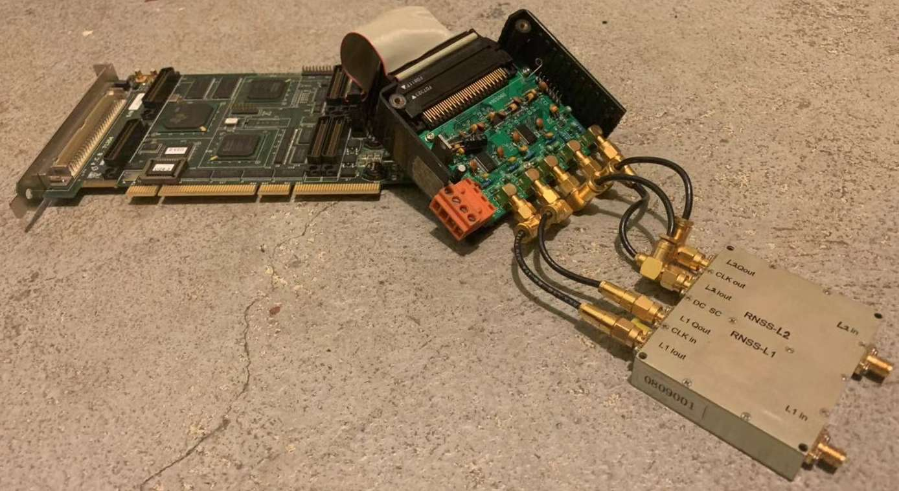

# GPS/GLONASS L1/L2 receiver design
1 FFT based search and tracking for live-GPS IF signal stream
2 Xilinx platform VHDL implemention of baseband tracking loop pre-processing
3 TI 6713 DSP C implmenetation for GPS/Glonass L1/L2 tracking loop closure and measurement extraction

Mini-circuit RF to IF down-conversion chain or the bottom-right RF-FE produces the analog IF input to the complex IF sampling circuit in the middle. The digital IQ stream is fed to the FGPA for pre-processing tasks such as correlation, coupled with DSP PLL/FLL/DLL loop closure with adjustable parameters.
